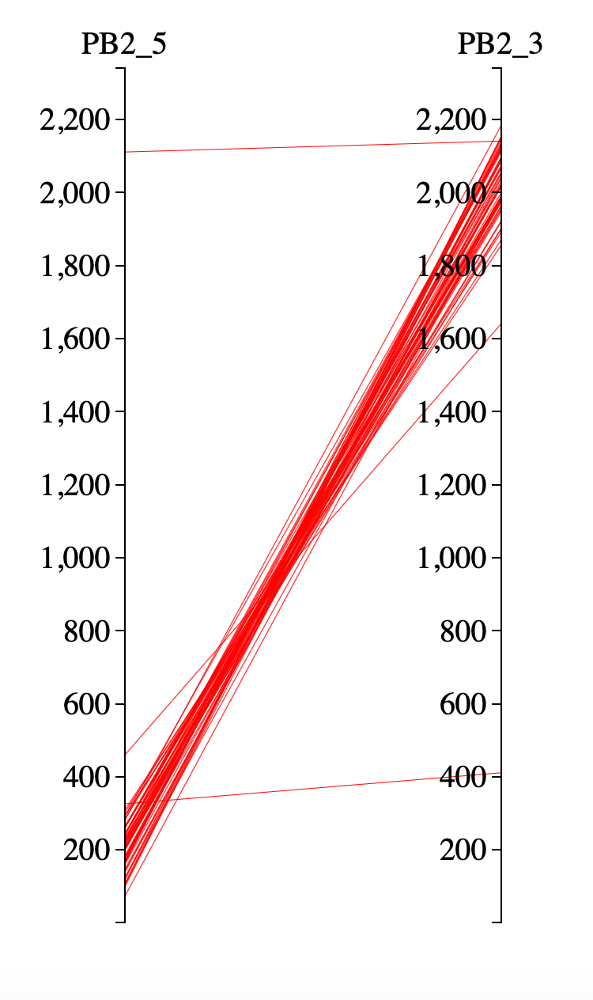

# Parallel coordinate

The parallel coordinate is a common way in visualizing high dimensional data; it connects the data points through parallel axes. In our research, we use the parallel coordinates method to visualize the start and end sites of DIPs on the genome. 

The parallel-coordinates DI maps were generated by adapting an example code (https://observablehq.com/@drimaria/parallel-coordinates-d3-v4) from the D3.js platform; which is an open-source Javascript library for data visualization.

To generate the maps  (on Mac) you need to do the following:

1) Copy all the files to one folder under the folder parallel coordinates 
2) Open the Terminal, and travel to the folder where you placed the files
3) Type: python -m SimpleHTTPServer
4) Open safari or any browser and go to: http://127.0.0.1:8000
5) Press on PB2_DI_Map.html
6) You should see the map with DI lines in red (Fig 1). Now you can download a PDF version of the map to be used in PowerPoint or photo editor like Adobe illustrator to produce publishable figures like Fig 2 

 <figcaption>Fig.1 - PR8_PB2 DI map</figcaption>  
 

 <figcaption>Fig.2 - DI maps for five PR8 segments</figcaption>  
 
 
So basically, you are creating a local environment to run the D3.js library (you can read more about in the D3.js documentation: https://github.com/d3/d3/wiki). To run your own DIs, you need the start and end sites to be saved in the CSV file, exactly the same way as in the PR8_PB2_DI.csv. For the control sites, you need to add the first and last position of your genome. On the other hand, you can manipulate the features of the maps from the HTML code; you need to open the code by any text editor and change the values or whatever you need (remember to save the changes). Have a look at the word document of the HTML code, where comments were added to explain the values and variables that you can mess with.  

