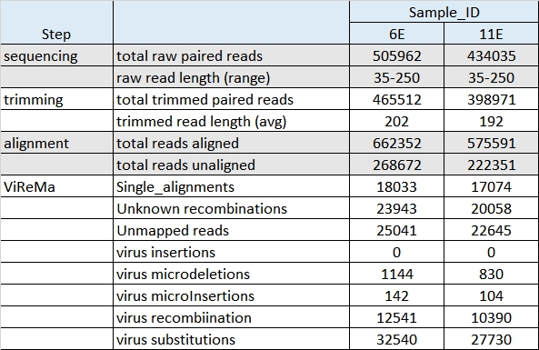

# Workflow of the pipeline

The first steps are done manually: Sample collection, fluidigm library preparation and sequencing in an Illumina platform.
The nextflow pipeline performs steps three thorugh five and generates DIPs.
Finally, the comparative analysis can be performed with programs provided here

# Sample collection, fluidigm library preparation and sequencing

## download these fastq files from our page

Our fastq files are paired-ended reads. These files have been demultiplexed and sorted by primer.

- Total paired reads in 6E: 505,962  Read length between 35-250
- Total paired read in 11E: 434,035  Read length between 35-250

They are FOUR files in total and are available for download from:  (some-data-hosting-place/testdata/raw-seq)

Create a folder called *data/raw-seq* and copy these fastq files to that folder

<pre>

# create a new folder for these input files

mkdir -p data/raw-seq/runE-Cal07

# go to that folder

cd data/raw-seq/runE-Cal07

# download the files

wget some-data-hosting-place/testdata/raw-seq/* 

</pre>

## or DIY: 

Sample 6E: Details will be provided by Fadi

Sample 11E: Details will be provided by Fadi

# Genome preparation

## download the genomes from our page

The flu genomes in fasta format and the corresponding index files are available for download from:
(some-data-hosting-place/testdata/genomes)

Create a folder called *data/genomes* and copy all files files to that folder

<pre>

# create a new folder called genomes inside the folder data
mkdir -p data/genomes

# go to that folder

cd data/genomes

# download the files

wget some-data-hosting-place/testdata/genomes/*

</pre>

Your genomes folder should now look like this: 

## or DIY:

- get the fasta files of the flu genomes

download site of PR8 genome : https://www.ncbi.nlm.nih.gov/Taxonomy/Browser/wwwtax.cgi?id=183764

download site of Cal07 : https://www.ncbi.nlm.nih.gov/Taxonomy/Browser/wwwtax.cgi?id=1970186

- pad the genomes  to make ViReMa happy

ref-simple-Cal07.fasta  becomes ref-padded-Cal07.fasta

modified_PR8_ref.fasta becomes modified_PR8_ref_padded.fasta

- index the genomes with bowtie2 for the alignemnt step

<pre>
module load Bowtie2/2.3.2
bowtie2-build ref-simple-Cal07.fasta bowtie2-2.3.2-index/Cal07
bowtie2-build modified_PR8_ref.fasta bowtie2-2.3.2-index/modified_PR8
</pre>

- index the genomes with bowtie for the DI detection step with ViReMa

<pre>
module load Bowtie/1.2.0
bowtie-build ref-padded-Cal07.fasta bowtie-1.2.0-index/Cal07_padded
bowtie-build modified_PR8_ref_padded.fasta bowtie-1.2.0-index/modified_PR8_ref_padded
</pre>

# Running the pipeline 

## Installation instructions: 

Please follow this link: 

## Configure some parameters

- Trimmomatic trimming parameters can be adjusted to work with your own datasets.
- Bowtie2 alignment parameters can be tweaked to increase alignment accuracy.
- ViReMa parameters can be tweaked to increase DIP detection accuracy.

The results of our benchmarks with synthetic and real datasets are shown above 
and demonstrate that the following values work well for Trimmomatic, bowtie2 and ViReMa:

<pre>
Trimmomatic 'ILLUMINACLIP:$TRIMMOMATICPATH/adapters/TruSeq3-PE-2.fa:2:15:10 SLIDINGWINDOW:3:20 LEADING:28 TRAILING:28 MINLEN:75'
bowtie2  --score-min  'L,0,-0.3' 
ViReMa --MicroInDel 20
ViReMa --N  1
ViReMa --X  8
ViReMa --defuzz 3
</pre>

To change the values please edit the corresponding line(s) of the configuration file.
One such configuration file is provided here: .

Additional information that can also be specified inside the configuration file rather than at the command line include 

- input and output folders
- path to reference genome
- cluster resources such as memory and CPUs

It is important to put in the same input folder all fastq files that are going to be analyzed together by the same pipeline and with the same parameters. 

## To run the pipeline type these commands:

<pre>

# load the Nextflow module

module load Nextflow

# run the pipeline

nextflow run    -c  conf/runE-Cal07-setup3.conf    full-pipeline-customizable-v2.nf

</pre>

## Examine the results

You should see FOUR folders with results as shown here

- *trimmomatic* contains the QC and trimming step with Trimmomatic

Trimmomatic output files are explained here: http://www.usadellab.org/cms/uploads/supplementary/Trimmomatic/TrimmomaticManual_V0.32.pdf Page 4

- *fastqc_trim* contains the FastQC results on the trimmed files

FastQC output files are explained here: https://dnacore.missouri.edu/PDF/FastQC_Manual.pdf

- *bowtie2* contains the results of the alignment step with bowtie2

Bowtie2 output files are explained here: http://bowtie-bio.sourceforge.net/bowtie2/manual.shtml

- *virema* contains the results of the DIP detection step with ViReMa

ViReMa output files are explained here: https://sourceforge.net/projects/virema/files/

## Read Tracking: How many reads survived each analysis step?

- For the trimming and alignment steps we totaled the number of reads of the fastq files that these tools generated
- For the DIP detection step we totaled the number of events reported in each one of the output files with extension *.txt*

## Output files 

The output files are also found in the *virema* folder. They have extension <i>Recombination_Results.par*</i> and 
are produced by running the script parse-recomb-results-Fuzz.pl on this ViReMa file <i>Recombination_Results.txt</i>

<pre>
perl parse-recomb-results-Fuzz.pl -i $in_file -o ${in_file}.par  -d 1
perl parse-recomb-results-Fuzz.pl -i $in_file -o ${in_file}.par5 -d 5
</pre>

Let's take a peek inside one of those files: 

<pre>

$ head 6_TTGGACTC-GGAAGCAG_L001both_unaligned_Virus_Recombination_Results.par

Segment Start   Stop    Forward_support Reverse_support Total_support   Fuzz_factor
CY1216804       100     1431    1       0       1       1
CY1216804       100     1461    1       0       1       0
CY1216804       1024    1732    0       2       2       6
CY1216804       102     1526    1       0       1       1
CY1216804       103     1533    23      3       26      1
CY1216804       105     1479    1       0       1       0
CY1216804       105     1518    1       0       1       0
CY1216804       105     1533    15      3       18      0
CY1216804       105     1547    77      6       83      0

</pre>

# Further analyses: Compare the DIP profiles of two or more samples

Our samples are biological replicates. In theory they should have identical results; 
in practice, we DO need to verify how well their DIP profie  match.

<pre>
# create a folder for this analysis

mkdir comp_6E_11E
cd comp_6E_11E

# populate the folder with the files that will be compared

ln -s ../virema/6_*.par5 ./
ln -s ../virema/11_*.par5 ./

# check that you have these input files with the ls command

ls

11_ATGTAAGT-ACTCTATG_L001both_unaligned_Virus_Recombination_Results.par5
6_TTGGACTC-GGAAGCAG_L001both_unaligned_Virus_Recombination_Results.par5

# run the script

perl CreateMatrix_DIpar5.pl -d ./ -o 6E_vs_11E-CompMatrix-w-par5.tsv -f 1 -m 5

# check again. The output file is 6E_vs_11E-CompMatrix-w-par5.tsv

ls

11_ATGTAAGT-ACTCTATG_L001both_unaligned_Virus_Recombination_Results.par5
6_TTGGACTC-GGAAGCAG_L001both_unaligned_Virus_Recombination_Results.par5
6E_vs_11E-CompMatrix-w-par5.tsv

# let's take a peek

head 6E_vs_11E-CompMatrix-w-par5.tsv

DIs     11_ATGTAAGT-ACTCTATG_1  6_TTGGACTC-GGAAGCAG_2
CY1216804_103_1533      22      28
CY1216804_105_1533      20      21
CY1216804_105_1547      84      92
CY1216804_105_1580      7       14
CY1216804_106_1527              6
CY1216804_108_1449      8       19
CY1216804_119_1526      6       6
CY1216804_123_1520              13
CY1216804_123_1539      5

</pre>

# Compare your results to ours

Simply download the results folder

<pre>

# download the files

wget some-data-hosting-place/results/*

</pre>

